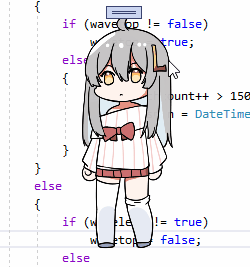

# V-Max (Virtual Max)

**V-Max** est un compagnon de bureau francophone pour Windows, en passe de devenir un agent IA de bureau autonome.
C'est un fork de [VPet](https://github.com/LorisYounger/VPet) (C# / WPF), remanié pour :

- une interface **100 % en français** ;
- une application **autonome**, sans Steam, sans télémétrie et sans serveur tiers ;
- une **interface repensée autour du compagnon** : anneau d'actions, bulle flottante, panneaux ancrés, notifications ;
- un **agent IA** branché sur des IA gratuites (Gemini, Groq, Mistral, Cerebras, OpenRouter, ou une IA locale Ollama / LM Studio), avec bascule automatique quand un quota est atteint.



## État du projet

| Jalon | Contenu | État |
|---|---|---|
| Étape 1 | Fork, compilation .NET 10, retrait de Steam, francisation | ✅ |
| Étape 2 | Rapport d'audit (dette technique, performances, UX) | ✅ [docs/AUDIT.md](docs/AUDIT.md) |
| Étape 3 | Vision et architecture « agent IA » | ✅ [docs/VISION.md](docs/VISION.md) |
| Étape 4 | v1.0 : interface 2026, performances, socle agent IA | 🚧 bien avancée (voir [AUDIT §12.2](docs/AUDIT.md#122-feuille-de-route-de-la-v10)) |

## Compiler et lancer

Prérequis : Windows 10/11 et le [SDK .NET 10](https://dotnet.microsoft.com/download/dotnet/10.0).

```bash
dotnet build VPet-Simulator.Windows/VPet-Simulator.Windows.csproj -c Debug -p:Platform=x64
```

Au premier lancement, l'application a besoin du dossier `mod` à côté de l'exécutable. Une jonction suffit, sans droits administrateur :

```bash
cmd /c mklink /J VPet-Simulator.Windows\bin\x64\Debug\net10.0-windows7.0\mod VPet-Simulator.Windows\mod
```

Lancez ensuite `VPet-Simulator.Windows\bin\x64\Debug\net10.0-windows7.0\VPet-Simulator.Windows.exe`.

> L'éditeur de paramètres `VPet.Solution` ne compile pas pour l'instant : le tisseur Fody `HKW.MVVM.SourceGenerator` est incompatible avec .NET 10. Ce problème vient du projet d'origine et il est suivi dans l'audit.

## Interface

Tout part du compagnon :

| Geste | Effet |
|---|---|
| Clic droit sur le compagnon | Anneau d'actions : Discuter, Nourrir, Occupations, Dormir, État, Plus, Paramètres |
| `Ctrl+Alt+Espace` (n'importe où) | Ouvre la discussion |
| Échap | Ferme le panneau ouvert |

Les panneaux (discussion, garde-manger, occupations, état, « Plus ») s'ouvrent à côté du compagnon, du côté où l'écran a de la place, et le suivent quand il se déplace. Le panneau « Plus » est construit depuis les menus de VPet : les entrées ajoutées par les plugins y apparaissent automatiquement.

## Agent IA

1. Ouvre la discussion (anneau › **Discuter** ou `Ctrl+Alt+Espace`).
2. Au premier lancement, la discussion propose les IA gratuites : clique sur **Obtenir une clé**, colle-la, **Connecter**. La clé est vérifiée puis stockée dans le Gestionnaire d'identification Windows. Une IA locale (Ollama, LM Studio) est détectée sans configuration.
3. Connecte plusieurs fournisseurs : quand l'un atteint son quota, le suivant prend le relais sans interrompre la conversation.

Les fournisseurs se gèrent aussi dans **Paramètres › Intelligence artificielle** (état en direct, modèle par fournisseur en mode avancé).

L'agent peut lire l'état du PC, contrôler la musique et le volume, ouvrir une page web, une application ou un dossier, lancer un minuteur et verrouiller la session (avec ta confirmation). Chaque action est inscrite dans `%APPDATA%\V-Max\agent-audit.log`, et chaque outil peut être désactivé dans les paramètres avancés.

## Données

| Emplacement | Contenu |
|---|---|
| `%APPDATA%\V-Max` | Paramètres, sauvegardes, copies de secours, journaux, journal de l'agent |
| `%LOCALAPPDATA%\V-Max` | Cache des animations, approbations des plugins (empreintes SHA-256) |
| Gestionnaire d'identification Windows | Clés API (`V-Max/GeminiApiKey`, `V-Max/GroqApiKey`, `V-Max/MistralApiKey`, `V-Max/CerebrasApiKey`, `V-Max/OpenRouterApiKey`) |

Mode portable : un fichier `portable.txt` à côté de l'exécutable garde toutes les données dans le dossier d'installation.

## Structure

| Projet | Rôle |
|---|---|
| `VPet-Simulator.Core` | Moteur du compagnon : animations, affichage, logique d'état |
| `VPet-Simulator.Windows.Interface` | API des plugins et des mods (`IMainWindow`, `MainPlugin`…) |
| `VPet-Simulator.Windows` | Application de bureau (fenêtres, paramètres, chargement des mods) |
| `VPet.Solution` | Éditeur de paramètres et visionneuse de sauvegardes |
| `VPet-Simulator.Windows/mod/0000_core` | Contenu de base : animations, textes, objets, traductions (`lang/`) |
| `tools/i18n` | Outils de traduction (`check_lang.py`) |

## Traductions

Les textes sont traduits par les fichiers `mod/0000_core/lang/<culture>/*.lps`. Chaque ligne a la forme `clé#traduction:|`.

- Pour les textes hérités de VPet, la clé est la chaîne chinoise d'origine.
- Pour les nouveaux textes de V-Max, la clé est **le texte français lui-même** (fichier `VMax.lps`).

Le français est la langue par défaut. Pour vérifier une traduction :

```bash
python tools/i18n/check_lang.py fr
```

## Licences et crédits

- Le **code** est publié sous [licence Apache 2.0](LICENSE), comme le projet d'origine VPet © exLB.org / LorisYounger.
- Les **animations du compagnon** (`mod/0000_core/pet/vup`) et les images intégrées appartiennent à l'équipe **VUP-Simulator**. Elles sont utilisées selon les conditions d'autorisation de VPet :
  - usage non commercial avec mention de la source et lien vers <https://github.com/LorisYounger/VPet> ;
  - **tout usage commercial nécessite l'accord préalable de l'auteur** et l'affichage de la source au premier lancement ;
  - interdiction de tirer profit de la vente de ces fichiers ;
  - la galerie d'images « Zip » est interdite à tout usage commercial.

  Voir [docs/upstream/README_en.md](docs/upstream/README_en.md#animation-copyright-notice-and-authorization-terms).
- La documentation d'origine de VPet (en plusieurs langues) est conservée dans [`docs/upstream/`](docs/upstream/).
